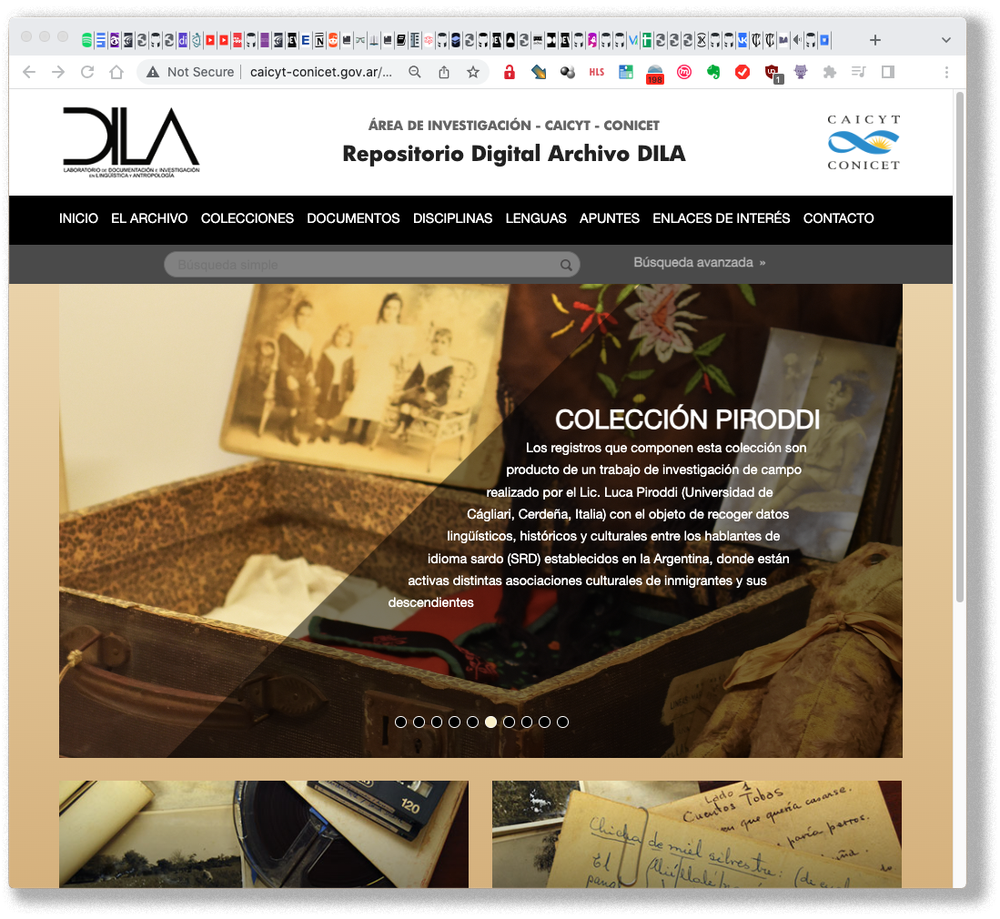

# FUNDAMENTO #

* Este repositorio persigue simplemente el registro de los cambios llevados a cabo en la transición entre un servidor a otro, su flujo de trabajo y las estrategias digitales implicadas. Entre las herramientas _open source_ utilizadas están [Omeka](https://omeka.org/), servidores Apache, base de datos MySQL, [Wordpress](https://wordpress.org/); lenguaje de programación PHP _et alia_.
* Es un repositorio con fines específicos y de uso interno.

### Transferencia ###

* Resumen de la configuración
    - 

### Contribuciones ###

* Si alguien desea contribuir a este repositorio y mejorar el proceso de transferencia o la documentación asociada, se pueden enviar solicitudes de extracción, _aka_ *pull requests*. Se agradecen todas las contribuciones que ayuden a mejorar y optimizar este proceso de transferencia.

### Legales ##

* Todas las marcas registradas son propiedad de sus respectivos propietarios.

### Licencia ###

* Este repositorio se distribuye bajo la licencia , que especifica los términos y condiciones de uso. Consulte el archivo [LICENSE](LICENSE) para obtener más información.