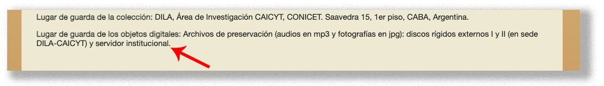
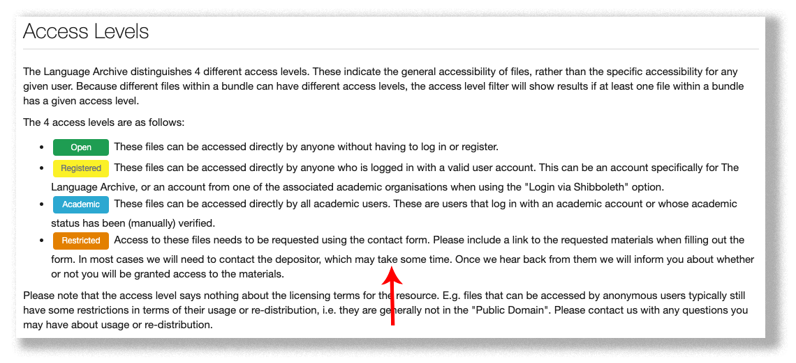
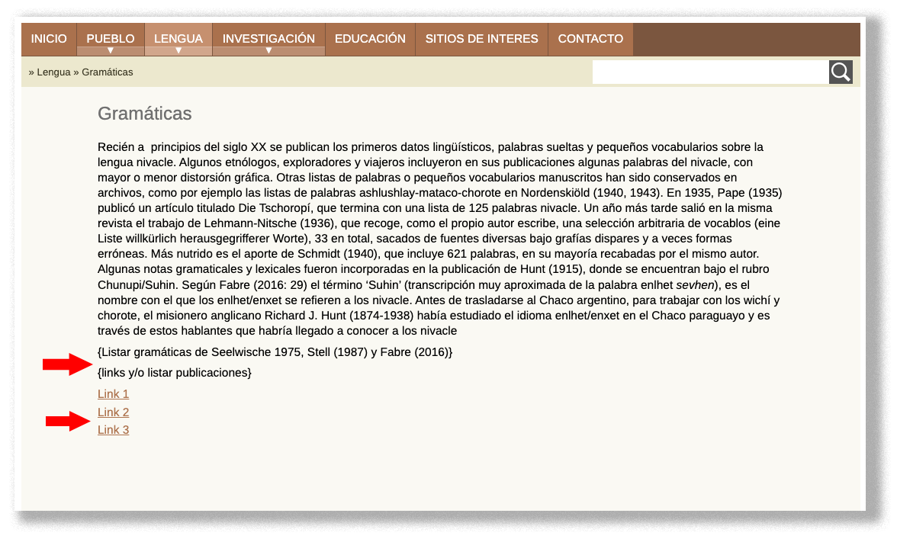
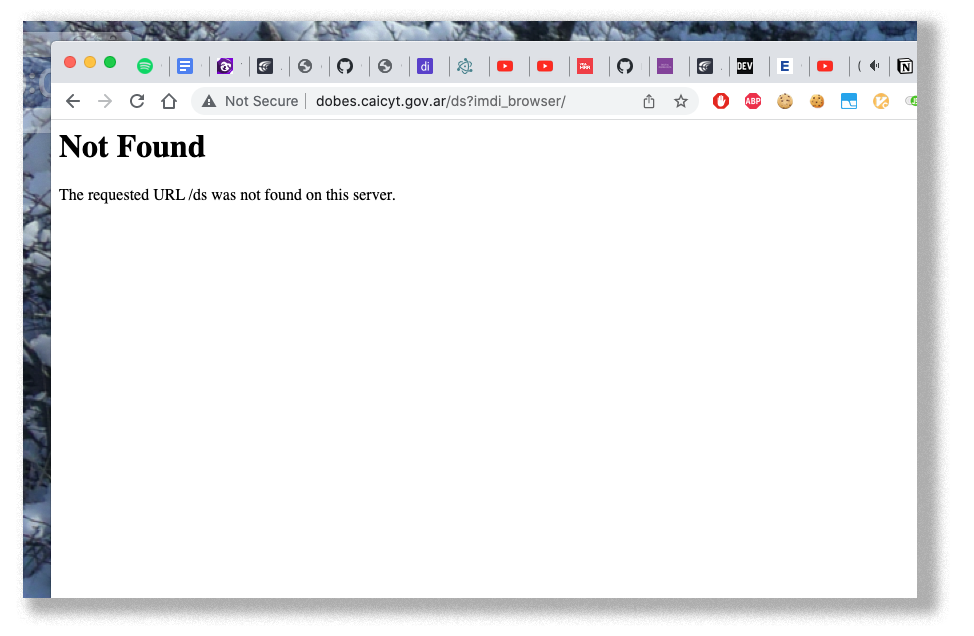

# Propuestas
## Sitios 
   
### Sitio Archivo DILA → http://www.caicyt-conicet.gov.ar/dila/
* Información de copyright no está especificado:
	
	- [http://www.caicyt-conicet.gov.ar/dila/acercade](http://www.caicyt-conicet.gov.ar/dila/acercade)
   
   
* Copyright o tipo de licencia no está especificado:
	
	- [http://www.caicyt-conicet.gov.ar/dila/items/show/13268#?c=0&m=0&s=0&cv=0](http://www.caicyt-conicet.gov.ar/dila/items/show/13268#?c=0&m=0&s=0&cv=0)
   
   
* Actualizar información:
	- [ ] Horarios de atención
	- [ ] Números de teléfono
	
	- [http://www.caicyt-conicet.gov.ar/dila/](http://www.caicyt-conicet.gov.ar/dila/)
   
   
* Actualizar información:
	- [ ] Sí
	- [ ] No
	
	- [http://www.caicyt-conicet.gov.ar/dila/acercade](http://www.caicyt-conicet.gov.ar/dila/acercade)
   
   
* Actualizar información:
	- [ ] Sí
	- [ ] No
	
	- [http://www.caicyt-conicet.gov.ar/dila/inventario-detallado-de-la-coleccin-piroddi](http://www.caicyt-conicet.gov.ar/dila/inventario-detallado-de-la-coleccin-piroddi)
   
   
* Actualizar información:
	- [ ] Sí
	- [ ] No
	
	- [http://www.caicyt-conicet.gov.ar/dila/inventario-detallado-de-la-coleccin-piroddi](http://www.caicyt-conicet.gov.ar/dila/inventario-detallado-de-la-coleccin-piroddi)
   
   
* Typo
	- [ ] _Universidsd_
	
	- [http://www.caicyt-conicet.gov.ar/dila/inventario-detallado-de-la-coleccin-stell](http://www.caicyt-conicet.gov.ar/dila/inventario-detallado-de-la-coleccin-stell)
   
   
* Actualizar información:
	- [ ] Sí
	- [ ] No
	
	- [http://www.caicyt-conicet.gov.ar/dila/inventario-detallado-de-la-coleccin-stell](http://www.caicyt-conicet.gov.ar/dila/inventario-detallado-de-la-coleccin-stell)
   
   
* Actualizar información:
	- [ ] Sí
	- [ ] No
	
	- [http://www.caicyt-conicet.gov.ar/dila/inventario-detallado-del-fondo-bucca](http://www.caicyt-conicet.gov.ar/dila/inventario-detallado-del-fondo-bucca)
   
   
* Typo
	- [ ] _centrósus_
	
	- [http://www.caicyt-conicet.gov.ar/dila/isad-g--fondo-conicet_caicyt_dila_ibarra](http://www.caicyt-conicet.gov.ar/dila/isad-g--fondo-conicet_caicyt_dila_ibarra)
   
   
* Sintaxis
	- [ ] _a través de_ cualquier dispositivo
	
	- [http://www.caicyt-conicet.gov.ar/dila/inventario-detallado-de-la-coleccin-gualdieri](http://www.caicyt-conicet.gov.ar/dila/inventario-detallado-de-la-coleccin-gualdieri)
   
   
* Actualizar información:
	- [ ] Sí
	- [ ] No
	
	- [http://www.caicyt-conicet.gov.ar/dila/inventario-detallado-de-la-coleccin-scarpa](http://www.caicyt-conicet.gov.ar/dila/inventario-detallado-de-la-coleccin-scarpa)
   
   
* Actualizar información:
	- [ ] Sí
	- [ ] No
	
	- [http://www.caicyt-conicet.gov.ar/dila/inventario-detallado-de-la-coleccin-gualdieri](http://www.caicyt-conicet.gov.ar/dila/inventario-detallado-de-la-coleccin-gualdieri)
   
   
* Actualizar información:
	- [ ] Sí
	- [ ] No
	
	- [http://www.caicyt-conicet.gov.ar/dila/inventario-detallado-de-la-coleccin-dreidmie](http://www.caicyt-conicet.gov.ar/dila/inventario-detallado-de-la-coleccin-dreidmie)
   
   
* Actualizar sección “Documentos de esta colección” ➔ No hay recursos a visualizar:
	- [ ] Sí
	- [ ] No
	
	
	- [http://www.caicyt-conicet.gov.ar/dila/collections/show/7](http://www.caicyt-conicet.gov.ar/dila/collections/show/7)
   
   
* Actualizar enlace (el acceso a los recursos está restringido):
	- [ ] Sí
	- [ ] No
	
	- [http://www.caicyt-conicet.gov.ar/dila/collections/show/7](http://www.caicyt-conicet.gov.ar/dila/collections/show/7)
	   
* El enlace suministrado nos redirecciona a esta situación:
	- acceder a los recursos está restringido
	- requiere una inscripción
	
	- [https://archive.mpi.nl/tla/islandora/object/tla%3A1839_00_0000_0000_0007_E856_1](https://archive.mpi.nl/tla/islandora/object/tla%3A1839_00_0000_0000_0007_E856_1)
	   
* Para acceder al recurso, es necesario la inscripción y aprobación del Staff Académico
	
	- [https://archive.mpi.nl/tla/user/register](https://archive.mpi.nl/tla/user/register)
   
   
* Actualizar sección “Documentos de esta colección” ➔ No hay recursos a visualizar:
	- [ ] Sí
	- [ ] No
	
	- [http://www.caicyt-conicet.gov.ar/dila/collections/show/6](http://www.caicyt-conicet.gov.ar/dila/collections/show/6)
	   
* Si hacemos clic en `Ver Todos`
	
	- [http://www.caicyt-conicet.gov.ar/dila/items/browse?collection=6](http://www.caicyt-conicet.gov.ar/dila/items/browse?collection=6)
	   
* Si hacemos clic en el enlace del [Programa Dobes](https://archive.mpi.nl/tla/islandora/object/tla%3A1839_00_0000_0000_0001_305B_C) de [The Language Archive](https://archive.mpi.nl/tla/) nos informa que:
	- el enlace está restringido
	
	- [https://archive.mpi.nl/tla/islandora/object/tla%3A1839_00_0000_0000_0001_34DF_9?asOfDateTime=2018-03-02T11%3A00%3A00.000Z&f%5B0%5D=cmd.Contributor%3A%22Maria%5C%20Hellemeyer%22](https://archive.mpi.nl/tla/islandora/object/tla%3A1839_00_0000_0000_0001_34DF_9?asOfDateTime=2018-03-02T11%3A00%3A00.000Z&f%5B0%5D=cmd.Contributor%3A%22Maria%5C%20Hellemeyer%22)
	- Los enlaces requieren de una inscripción para su visualización y/o escucha:
	
	- [https://archive.mpi.nl/tla/access-levels](https://archive.mpi.nl/tla/access-levels)
   
   
* Actualizar información (las Colecciones pertenecientes al Programa DOBES) no ofrecen ningún recurso a consultar:
	- [ ] Sí
	- [ ] No
	
	- [http://www.caicyt-conicet.gov.ar/dila/items/browse?search=&collection=6&type=21&advanced%5B0%5D%5Belement_id%5D=42&advanced%5B0%5D%5Btype%5D=&advanced%5B0%5D%5Bterms%5D=&submit_search=Buscar+por+items](http://www.caicyt-conicet.gov.ar/dila/items/browse?search=&collection=6&type=21&advanced%5B0%5D%5Belement_id%5D=42&advanced%5B0%5D%5Btype%5D=&advanced%5B0%5D%5Bterms%5D=&submit_search=Buscar+por+items)
   
   
* Actualizar información, enlace roto:
	
	- [http://www.caicyt-conicet.gov.ar/dila/los-chamacocos-prueba](http://www.caicyt-conicet.gov.ar/dila/los-chamacocos-prueba)
   
   
* Enlace roto:
	
	- [http://www.caicyt-conicet.gov.ar/dila/los-chamacocos-prueba](http://www.caicyt-conicet.gov.ar/dila/los-chamacocos-prueba)
   
   
* Actualizar información, enlace roto:
	
	- [http://www.caicyt-conicet.gov.ar/dila/collections/show/9](http://www.caicyt-conicet.gov.ar/dila/collections/show/9)
   
   
* Enlace “Mitos” genera “[infinite loop](https://en.wikipedia.org/wiki/Infinite_loop)”
	
	- [http://www.caicyt-conicet.gov.ar/dila/exhibits?tags=Mitos](http://www.caicyt-conicet.gov.ar/dila/exhibits?tags=Mitos)
   
   
* Typo y referencia URL:
	- [ ] Ver _mas_
	- [ ] `localhost`
	- [ ] `127.0.0.1`
	
	
	- [http://www.caicyt-conicet.gov.ar/dila/items/show/7767#?c=0&m=0&s=0&cv=0](http://www.caicyt-conicet.gov.ar/dila/items/show/7767#?c=0&m=0&s=0&cv=0)
   
   
### Micrositio DILA → http://www.caicyt-conicet.gov.ar/micrositios/dila/
* Transferir micro-sitio:
	- [ ] Sí
	- [ ] No
	
	- [http://www.caicyt-conicet.gov.ar/micrositios/dila/](http://www.caicyt-conicet.gov.ar/micrositios/dila/)
   
   
### Sitio La lengua nivaĉle → https://r020.com.ar/lab/caicyt/nivacle/
* Cambiar logotipo:
	- [ ] Sí
	- [ ] No
	
	- [https://r020.com.ar/lab/caicyt/nivacle/](https://r020.com.ar/lab/caicyt/nivacle/)
   
   
* Los enlaces se dirigen a un mismo sitio:
	- [ ] https://r020.com.ar/web/
	
	- [https://r020.com.ar/lab/caicyt/nivacle/sitios-de-interes](https://r020.com.ar/lab/caicyt/nivacle/sitios-de-interes)
   
   
* ¿Eliminar estos textos?
	- [ ] Sí
	- [ ] No
	
	- [https://r020.com.ar/lab/caicyt/nivacle/educacion](https://r020.com.ar/lab/caicyt/nivacle/educacion)
   
   
* ¿Eliminar estos textos?
	- [ ] Sí
	- [ ] No
	
	- [https://r020.com.ar/lab/caicyt/nivacle/comunidades](https://r020.com.ar/lab/caicyt/nivacle/comunidades)
   
   
* ¿Eliminar estos textos?
	- [ ] Sí
	- [ ] No
	
	- [https://r020.com.ar/lab/caicyt/nivacle/comunidades](https://r020.com.ar/lab/caicyt/nivacle/comunidades)
   
   
* Actualizar textos
	- [ ] Sí
	- [ ] No
	
	- [https://r020.com.ar/lab/caicyt/nivacle/diccionarios](https://r020.com.ar/lab/caicyt/nivacle/diccionarios)
   
   
* Actualizar textos y enlaces
	- [ ] Sí
	- [ ] No
	
	- [https://r020.com.ar/lab/caicyt/nivacle/gramaticas](https://r020.com.ar/lab/caicyt/nivacle/gramaticas)
   
   
* Actualizar información en sección `Contacto`
	- [ ] Sí
	- [ ] No
	
	- [https://r020.com.ar/lab/caicyt/nivacle/contact](https://r020.com.ar/lab/caicyt/nivacle/contact)
   
   
### Sitio Archivo DoBeS - Lenguas del Chaco → http://dobes.caicyt.gov.ar/ds?imdi_browser/
* Sitio no encontrado (http://dobes.caicyt.gov.ar/ds?imdi_browser/)
	- Se accedió el 15 de mayo de 2023
	
	- [http://dobes.caicyt.gov.ar/ds?imdi_browser/](http://dobes.caicyt.gov.ar/ds?imdi_browser/)
   
   
### Sitio Glosario de Antropología y Arqueología → http://vocacularios.caicyt.gov.ar/antropoglosa
* Sitio no encontrado (http://vocacularios.caicyt.gov.ar/antropoglosa)
	- Se accedió el 15 de mayo de 2023
	
	- [http://vocacularios.caicyt.gov.ar/antropoglosa](http://vocacularios.caicyt.gov.ar/antropoglosa)

   
   
### Misceláneas:
#### Omeka
* ¿Está planificada la actualización de [Omeka](https://omeka.org/classic/docs/Installation/Upgrading/)?
* [Omeka vulnerabilidades](https://www.cvedetails.com/vulnerability-list/vendor_id-13565/product_id-28202/Omeka-Omeka.html)
* ¿Existe la posibilidad de agregar este _plugin_ para poder compartir la difusión del sitio? Ver [plugin-SocialBookmarking](https://github.com/omeka/plugin-SocialBookmarking)
* ¿Existe la posibilidad de exportar datos _vía_ [CSV export](https://github.com/utlib/CsvExport) o [Database Transfer](https://github.com/iwemuiser/plugin-DatabaseTransfer)
* ¿Existe la posibilidad de verificar enlaces rotos _vía_ [CheckLinks](https://github.com/EMAN-Omeka/CheckLinks)
* ¿Existe la posibilidad de generar un mapa del sitio _vía_ [Sitemap](https://github.com/BGSU-LITS/omeka-plugin-Sitemap), [XMLSitemap](https://github.com/kevinreiss/Omeka-XMLSitemap) & [SiteMap2](https://github.com/UCSCLibrary/Sitemap)?
* ¿Existe la posibilidad de habilitar las [breadcrumbs](https://github.com/omeka/Omeka/blob/master/application/libraries/Zend/View/Helper/Navigation/Breadcrumbs.php) para facilitar la lectura y orientación dentro de las colecciones al usuario final?
* ¿Posibilidad de implementar un [Changelog](https://codingpotions.com/changelogs/)?
* ¿Qué plugins están habilitados, cuáles están programados para activarse y desactivarse en un futuro?
* ¿Existe una página `404` y `Sitio en mantenimiento`?
#### Backlinks
* Actualizar _backlinks_ del Dila: [https://www.google.com/search?q=link%3Ahttp%3A%2F%2Fwww.caicyt-conicet.gov.ar%2Fdila&oq=link%3Ahttp%3A%2F%2Fwww.caicyt-conicet.gov.ar%2Fdila&aqs=chrome..69i57j69i58.13613j0j7&sourceid=chrome&ie=UTF-8](https://www.google.com/search?q=link%3Ahttp%3A%2F%2Fwww.caicyt-conicet.gov.ar%2Fdila&oq=link%3Ahttp%3A%2F%2Fwww.caicyt-conicet.gov.ar%2Fdila&aqs=chrome..69i57j69i58.13613j0j7&sourceid=chrome&ie=UTF-8) 
* Actualizar _backlink_ del micro-sitio del Dila: _v. gr._: [https://diccionariowichi.com.ar/creditos/instituciones/](https://diccionariowichi.com.ar/creditos/instituciones/)
* ¿Generar una política de [intercambio de enlaces](https://www.isocialweb.agency/wiki/intercambio-de-enlaces/)?
#### Servidor
* Política de backups: ¿periodicidad, _cron_ jobs?
* ¿Hay un servidor espejo del sitio?
* ¿Existe un `robots.txt`? → [robots.txt](robots.txt)
* ¿ Existe una página de estado operacional del servidor [system page status](https://updown.io/p/4isvl)?